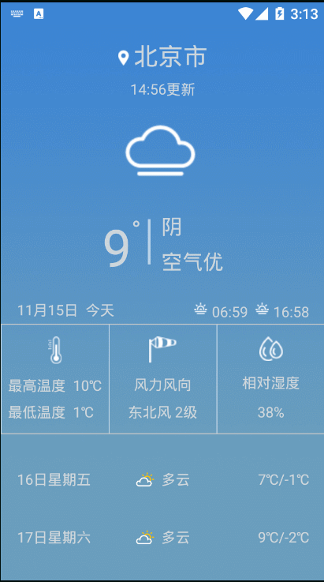

## 案例效果演示



## 功能描述

1）设置状态栏颜色

```
// 设置阴天的状态栏 #547282
StatusBarUtil.setStatusBarColor(this, Color.parseColor("#547282"));
```

2）选择城市

```
// 选择城市
public void showCityDialog(View view) {
    View v = getLayoutInflater().inflate(R.layout.half_dialog_view, null);
    final EditText editText = (EditText) v.findViewById(R.id.dialog_edit);
    AlertDialog dialog = new AlertDialog.Builder(this)
            .setTitle("选择城市")//设置对话框的标题
            .setView(v)
            .setNegativeButton("取消", new DialogInterface.OnClickListener() {
                @Override
                public void onClick(DialogInterface dialog, int which) {
                    dialog.dismiss();
                }
            })
            .setPositiveButton("确定", new DialogInterface.OnClickListener() {
                @Override
                public void onClick(DialogInterface dialog, int which) {
                    String content = editText.getText().toString();
                    initData(content);
                    tvCity.setText(content.contains("市") ? content : content + "市");
                    dialog.dismiss();
                }
            }).create();
    dialog.show();
}
```

3）异步访问网络

```
new DownloadWebpageText().execute(city);
```

```
/**
     * 访问网络异步进行
     */
    private class DownloadWebpageText extends AsyncTask {

        // onPostExecute displays the results of the AsyncTask.
        @Override
        protected void onPostExecute(Object o) {
            ...
        }

        @Override
        protected Object doInBackground(Object[] objects) {
            // params comes from the execute() call: params[0] is the url.
            try {
                return downloadUrl((String) objects[0]);
            } catch (IOException e) {
                return "Unable to retrieve web page. URL may be invalid.";
            }
        }

        private String downloadUrl(String cityCode) throws IOException {
            ...
        }

        /**
         * readIT2.0
         * 改进：可以读取整串流
         */
        public String readIt(InputStream stream, int len) throws IOException{
            ...
        }
    }
```

4）联网获取数据

这里我选择一个数据比较多的天气开源网站，你也可以访问其他网站提供的天气接口。

```
http://wthrcdn.etouch.cn/WeatherApi?city=北京
```

5）解析XML数据并将数据显示至界面中

        protected void onPostExecute(Object o) {
            WeatherData weatherData = new XMLParser().parseXML((String) o);
            updateWeather(weatherData);
        }
解析功能在封装好的 XMLParser 类中 