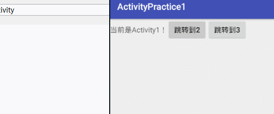
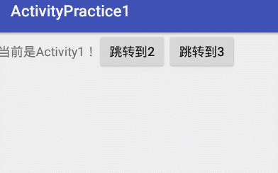

​	你已经掌握了相关活动非常多的知识，不过恐怕离完全灵活运用还有一段距离。虽然知识点只有这么多，但运用的技巧却是多种多样的所以，这里我准备教你关于活动的最佳实践技巧，这些技巧在你以后的工作中将会非常有用。

## 知晓当前是哪一个活动

​	这个技巧将会教你如何根据当前的界面就能判断出这是哪一个活动。可能不会觉得挺纳闷的，我自己写的代码怎么会不知道哪一个活动啦？很不幸的是，在你真正进入企业以后，更有可能的是接手一份别人的代码，因为你刚进公司就正好有一个新项目启动的几率并不高。阅读别人的代码有时是一个很头痛的问题，就当你需要在某个界面上修改一些非常简单的东西时，半天找不到这个界面对应哪一个活动。学会了本节的技巧后，这对你来说就再也不是难题了。

​	我们还是在ActivityTest项目的基础上修改，首先需要新建一个BaseAcyivity类。

​	注意这里是BaseActivity和普通活动创建方式并不一样，因为我们不需要让BaseActivity在AndroidManifest.xml中注册，所以选择创建一个普通的java类就可以了。然后让BaseActivity继承自AppCompatActivity，并重写onCreat（）方法，如下所示：

```java
public class BaseActivity extends AppCompatActivity {

    @Override
    public void onCreate(Bundle savedInstanceState) {
        super.onCreate(savedInstanceState);
        Log.e("BaseActivity", "onCreate: " + getClass().getSimpleName());
    }
}
```

​	我们在oncreat（）方法中获取了当前实例的类名，并通过Log打印出来。

​	接下来我们需要让BaseActivity成为ActivityTest项目中所有活动的父类。让其他的活动不在继承AppCompatActivity，而继承自BaseActivity。而由于BaseActivity有继承自AppCompatActivity，所以项目中所有活动的现有功能并不会受影响，他们仍然完全继承Activity中所有特性。

## 效果演示

​	现在当我们进入到一个活动界面，该活动的类名就会被打印出来，这样我们就可以时时刻刻知晓当前界面对应的是哪一个活动了。




# 随时随地的退出程序

​	如果目前你的手机界面还停留在ThirdActivity，你会发现当前想退出程序非常的不方便，需要连续3次Back键才行。按Home键只是把程序挂起，并没有退出程序。其实这个问题就是以引出你的思考，如果我们的程序需要一个注销或者退出的功能怎么办啦？必须要有一个随时随地的能退出程序的方案才行。

​	其实解决思路也很简单，只需要有一个专门的集合类对所有的活动进行管理就可以了，下面我们就来实现一下。

​	新建一个ActivityCollector类作为活动的管理器，代码如下：

```java
public class ActivityCollector {

    public static List<Activity> activities=new ArrayList<>();      // 定义一个Activity集合

    public static void addActivity(Activity activity){      // 集合中添加Activity的方法
        activities.add(activity);
    }

    public static void removeActivity(Activity activity){       // 集合中移除Activity的方法
        activities.remove(activity);
    }

    public static void finishAll(){     // finish掉所有的activity，退出应用所用到的方法
        for (Activity activity:activities){
            if(!activity.isFinishing()){
                activity.finish();      // finish掉activity
            }
        }
        activities.clear();     // 清空集合
    }
}
```

​	在活动管理器中，我们通过一个List来暂存活动，然后提供了一个addActivity（）方法用于向List中添加一个活动，提供了一个removeActivity方法用于从List中移除活动，最后提供了一个finish（）方法用于将List中存储的活动全部销毁调。

​	接下来修改BaseActivity中的代码，如下所示：

```java
public class BaseActivity extends AppCompatActivity {

    @Override
    public void onCreate(Bundle savedInstanceState) {
        super.onCreate(savedInstanceState);
        Log.e("BaseActivity", "onCreate: " + getClass().getSimpleName());
        ActivityCollector.addActivity(this);//正在创建的活动添加到活动管理器中
    }

    @Override
    protected void onDestroy() {
        super.onDestroy();
        ActivityCollector.removeActivity(this);//即将销毁的活动从活动管理器中移除

    }
}
```

​	在BaseActivity的onCreat（）方法中调用ActivityCollector的addActivity（）方法，表明将当前正在创建的活动添加到活动管理器里，然后在BaseActivity（）中重写onDestroy（）方法，并调用ActivityCollectroy的removeActivity（）方法，表明讲一个马上要销毁的活动从管理器中移除。

​	从此以后，不管你现在什么地方退出程序，只需要调用ActivityCollectroy。finishAll()方法就可以了。例如在ThirdActivity界面想通过点击按钮直接退出程序，只需要将代码改成如下:

```java
public void onFinish(View view) {
    ActivityCollector.finishAll();
}
```

## 效果演示



