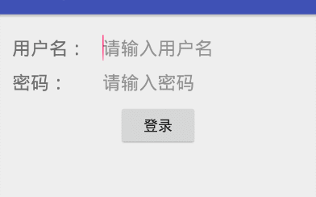

## 启动活动的最佳写法

​	启动活动的方法相信你已经非常熟悉了，首先通过Intent构建出当前的“意图”，然后调用startActivity（）或startActivityForResult（）方法将活动启动以来，如果有数据需要从一个活动传递到另一个活动，也可以借助Intent（）来完成。

​	假设SecondActivity中需要用到两个非常重要的字符串参数，在启动SecondActivity的时候必须传递过来，那么我们很容易会写出如下代码：

```java
        Intent intent = new Intent(MainActivity.this, Main2Activity.class);
        intent.putExtra("param1", "data1");
        intent.putExtra("param2", "data2");
        startActivity(intent);
```

​	这样写是完全正确的，不管是从语法上还是规范上，只是在真正的项目中经常会有对接的问题。比如SecondActivity并不是由你开发的，但是现在你负责的部分需要有启动SecondActivity这个功能，而你却不清楚启动这个活动需要传递那些数据。这时无非就有两种办法，一个是你自己趣阅读SecondActivity中的代码，二是询问负责编写SecondActivity中的同事，会不会觉得很麻烦？其实只需要换一种写法，就可以轻松解决掉上面的窘境。

​	修改MainActivity中的代码，如下图所示：

```Java
    public static void actionStart(Context context, String data1, String data2) {
        Intent intent = new Intent(context, Main2Activity.class);
        intent.putExtra("param1", data1);
        intent.putExtra("param2", data2);
        context.startActivity(intent);
    }
```

​	我们在SecondActivity中添加了一个actionStart（）方法，在这个方法中完成了Intent的构建，另外所有SecondACtivity中需要的数据都是通过actionStart（）方法的参数传递过来，然后把他们存·储到Intent中，最后调用startActivity。

​	这样写的好处在哪儿里？最重要的一点就是一目了然，SecondActivity所需要的数据在方法参数中全部体现出来了，这样即使不用认真阅读SecondActivity需要传递那些数据。另外，这样写还简化了启动活动的代码，现在只需要一行代码就可以启动了SecondActivity（），如下所示：

```java
actionStart(this,etUser.getText().toString(),etPassword.getText().toString());
```

​	养成一个良好的习惯，格尼编写的每个活动都添加类似的启动方法，这样不仅可以让启动活动变得非常简单，还可以节省不少你同事的时间。

## 案例效果演示

