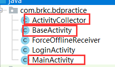
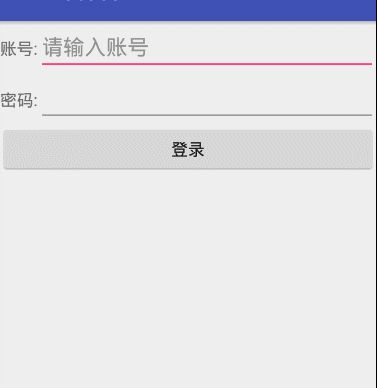

## 实现强制下线功能

​	强制下线功能功能应该算是比较常见的了，很多应用程序都具备这个功能，比如你的QQ号或者微信号在别处登录了，就会将你强制挤下线。只需要在界面上弹出一个对话框，让用户无法进行任何其他的操作，必须要点击对话框中的确定按钮，然后回到登录界面即可。可是这样就存在着一个问题，因为我们被通知需要强制下线时可能正处于任何一个界面，难道需要在每一个界面都编写一个弹出对话框的逻辑吗？如果真的是这样想那么思维就偏远了，我们完全可以借助所学的广播知识来实现这一个功能。

### 具体步骤

​	强制下线功能需要先关闭所有的活动，然后回到登录界面，所以我们需要 ActivityCollector 集中管理Activity。所以我们可以直接将第四章的综合练习部分代码复制过来，复制的工程目录如下



​	然后制作一个登陆界面，代码如下：

```java
<?xml version="1.0" encoding="utf-8"?>
<TableLayout
    xmlns:android="http://schemas.android.com/apk/res/android"
    android:id="@+id/activity_login"
    android:layout_width="match_parent"
    android:layout_height="match_parent"
    android:stretchColumns="1">

    <TableRow>

        <TextView
            android:layout_height="wrap_content"
            android:text="账号:"/>

        <EditText
            android:id="@+id/etAccount"
            android:layout_height="wrap_content"
            android:hint="请输入账号"/>
    </TableRow>

    <TableRow>

        <TextView
            android:layout_height="wrap_content"
            android:text="密码:"/>

        <EditText
            android:id="@+id/etPassword"
            android:layout_height="wrap_content"
            android:inputType="textPassword"/>
    </TableRow>

    <TableRow>
        <Button
            android:id="@+id/btnLogin"
            android:layout_height="wrap_content"
            android:layout_span="2"
            android:text="登录"/>
    </TableRow>

</TableLayout>
```

​	接着让登陆界面LoginActivity继承自BaseActivity

```java
public class LoginActivity extends BaseActivity implements View.OnClickListener {

    private EditText etAccount;
    private EditText etPassword;
    private Button btnLogin;

    @Override
    public void onCreate(Bundle savedInstanceState) {
        super.onCreate(savedInstanceState);
        setContentView(R.layout.activity_login);
        initView(); //初始化布局
    }

    private void initView() {
        etAccount = (EditText) findViewById(R.id.etAccount);
        etPassword = (EditText) findViewById(R.id.etPassword);
        btnLogin = (Button) findViewById(R.id.btnLogin);

        btnLogin.setOnClickListener(this);
    }

    @Override
    public void onClick(View view) {
        //获取用户输入的账号,密码的数据
        String account = etAccount.getText().toString();
        String password = etPassword.getText().toString();
        //如果账号是123且密码是123,就登录成功
        if (account.equals("123") && password.equals("123")){
            Intent intent = new Intent(LoginActivity.this,MainActivity.class);
            startActivity(intent);
            finish();
        }else {
            Toast.makeText(LoginActivity.this,"账号或密码是无效的",Toast.LENGTH_SHORT).show();
        }
    }
}
```

​	别忘记在AndroidManifest.xml中改变启动项

```java
<activity android:name=".LoginActivity">
    <intent-filter>
        <action android:name="android.intent.action.MAIN" />

        <category android:name="android.intent.category.LAUNCHER" />
    </intent-filter>
</activity>
```

​	同样在MainActivity继承BaseActivity，一个非常简单的MainActivity，不过多解释，代码如下所示：

```java
public class MainActivity extends BaseActivity implements View.OnClickListener {

    private Button btnOffline;

    @Override
    public void onCreate(Bundle savedInstanceState) {
        super.onCreate(savedInstanceState);
        setContentView(R.layout.activity_main);
        btnOffline = (Button) findViewById(R.id.btnOffline);

        btnOffline.setOnClickListener(this);
    }

    @Override
    public void onClick(View view) {
        Intent intent = new Intent("com.nyl.nativebroadcast.ForceOfflineReceiver");
        sendBroadcast(intent);
    }
}
```

​	创建一个广播接收器，代码如下所示：

```java
public class ForceOfflineReceiver extends BroadcastReceiver {

    @Override
    public void onReceive(final Context context, Intent intent) {
        AlertDialog.Builder dialogBuilder = new AlertDialog.Builder(context);
        dialogBuilder.setTitle("警告");
        dialogBuilder.setMessage("你被迫离线,请重新登录!");
        dialogBuilder.setCancelable(false);
        dialogBuilder.setPositiveButton("确定", new DialogInterface.OnClickListener() {
            @Override
            public void onClick(DialogInterface dialogInterface, int i) {
                /**
                 * 调用ActivityCollector的finishAll()方法来销毁掉所有的活动，
                 * 并重新启动LoginActivity这个活动
                 */
                ActivityCollector.finishAll();//销毁所以活动
                Intent intent = new Intent(context,LoginActivity.class);
                /**
                 * 在广播接收器里启动活动，因此一定要给Intent加入FLAG_ACTIVITY_NEW_TASK这个标准
                 */
                intent.addFlags(Intent.FLAG_ACTIVITY_NEW_TASK);
                context.startActivity(intent);
            }
        });
        AlertDialog alertDialog = dialogBuilder.create();
        //需要设置AlertDialog的类型，保证在广播接收器中可以正常弹出
        alertDialog.getWindow().setType(WindowManager.LayoutParams.TYPE_SYSTEM_ALERT);
        alertDialog.show();
    }
}
```

## 案例效果演示




