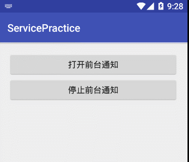

## 音乐播放器的前台通知

​	前台服务被认为是用户主动意识到的一种服务，因此在内存不足时，系统也不会考虑将其终止。 前台服务必须为状态栏提供通知，状态栏位于“正在进行”标题下方，这意味着除非服务停止或从前台删除，否则不能清除通知。例如将从服务播放音乐的音乐播放器设置为在前台运行，这是因为用户明确意识到其操作。 状态栏中的通知可能表示正在播放的歌曲，并允许用户启动 Activity 来与音乐播放器进行交互。如果需要设置服务运行于前台， 我们该如何才能实现呢？Android官方给我们提供了两个方法，分别是startForeground()和stopForeground()，这两个方式解析如下：

> startForeground(int id, Notification notification) 

​	该方法的作用是把当前服务设置为前台服务，其中id参数代表唯一标识通知的整型数，需要注意的是提供给 startForeground() 的整型 ID 不得为 0，而notification是一个状态栏的通知。

> stopForeground(boolean removeNotification) 

​	该方法是用来从前台删除服务，此方法传入一个布尔值，指示是否也删除状态栏通知，true为删除。 注意该方法并不会停止服务。 但是，如果在服务正在前台运行时将其停止，则通知也会被删除。

​	下面我们结合一个简单案例来使用以上两个方法，ForegroundService代码如下：

```Java
public class ForegroundService extends Service {

    /**
     * id不可设置为0,否则不能设置为前台service
     */
    private static final int NOTIFICATION_DOWNLOAD_PROGRESS_ID = 0x0001;
    private boolean isRemove;

    public ForegroundService() {
    }

    /**
     * Notification
     */
    public void createNotification() {
        //使用兼容版本
        NotificationCompat.Builder builder = new NotificationCompat.Builder(this);
        //设置状态栏的通知图标
        builder.setSmallIcon(R.drawable.kuwo);
        //设置通知栏横条的图标
        builder.setLargeIcon(BitmapFactory.decodeResource(getResources(), R.drawable.jayzhou));
        //禁止用户点击删除按钮删除
        builder.setAutoCancel(false);
        //禁止滑动删除
        builder.setOngoing(true);
        //右上角的时间显示
        builder.setShowWhen(true);
        //设置通知栏的标题内容
        builder.setContentTitle("双节棍");
        // 设置副标题
        builder.setContentText("周杰伦");
        //设置时间
        builder.setWhen(System.currentTimeMillis());
        //创建通知
        Notification notification = builder.build();
        //设置为前台服务
        startForeground(NOTIFICATION_DOWNLOAD_PROGRESS_ID, notification);
    }

    @Override
    public int onStartCommand(Intent intent, int flags, int startId) {
        int i = intent.getExtras().getInt("cmd");
        if (i == 0) {
            if (!isRemove) {
                createNotification();
            }
            isRemove = true;
        } else {
            //移除前台服务
            if (isRemove) {
                stopForeground(true);
            }
            isRemove = false;
        }

        return super.onStartCommand(intent, flags, startId);
    }

    @Override
    public void onDestroy() {
        //移除前台服务
        if (isRemove) {
            stopForeground(true);
        }
        isRemove = false;
        super.onDestroy();
    }

    @Nullable
    @Override
    public IBinder onBind(Intent intent) {
        return null;
    }
}
```

​	在ForegroundService类中，创建了一个notification的通知，并通过启动Service时传递过来的参数判断是启动前台服务还是关闭前台服务，最后在onDestroy方法被调用时，也应该移除前台服务。以下是MainActivity的实现：

```Java
public class MainActivity extends AppCompatActivity {

    @Override
    protected void onCreate(Bundle savedInstanceState) {
        super.onCreate(savedInstanceState);
        setContentView(R.layout.activity_main);
    }

    public void onOpenForegroundService(View view) {
        Intent intent = new Intent(this,ForegroundService.class);
        intent.putExtra("cmd",0);//0,开启前台服务,1,关闭前台服务
        startService(intent);
    }

    public void onStopForegroundService(View view) {
        Intent intent = new Intent(this,ForegroundService.class);
        intent.putExtra("cmd",1);//0,开启前台服务,1,关闭前台服务
        startService(intent);
    }
}
```

## 案例效果演示

