## 界面效果

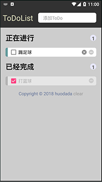

## 需要掌握的技能

1）嵌套布局的使用

4）控件摆放

2）TextFiled类型运用

3）事件监听机制（更新UI）

5）ListView的使用（BaseAdapter）

6）多个ListView的复合运用

7）Room框架下的数据库存储

## 功能实现

### 1——可添加任务

#### 1）内容栏可一键删除

##### 结果演示

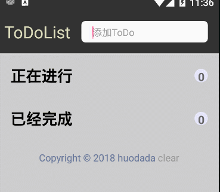

##### 代码实现

以下是xml布局部分的代码：

```java
<LinearLayout
    android:layout_width="match_parent"
    android:layout_height="35dp"
    android:layout_margin="18dp"
    android:background="@drawable/shape_white_et"
    android:orientation="horizontal">

    <TextView
        android:layout_width="wrap_content"
        android:layout_height="wrap_content"
        android:padding="1dp"
        android:text=" "
        android:textSize="11sp" />

    <TextView
        android:layout_width="1dip"
        android:layout_height="wrap_content"
        android:layout_centerVertical="true"
        android:layout_marginLeft="2dp"
        android:layout_marginRight="2dp"
        android:background="#EEEFFF" />

    <EditText
        android:id="@+id/et_content"
        android:layout_width="0dp"
        android:layout_height="match_parent"
        android:layout_marginLeft="2dp"
        android:layout_weight="1"
        android:background="@null"
        android:hint="添加ToDo"
        android:imeOptions="actionDone"
        android:padding="1dp"
        android:textSize="14sp">

        <!--<requestFocus />-->
    </EditText>

    <Button
        android:id="@+id/btn_del"
        android:layout_width="20dp"
        android:layout_height="20dp"
        android:layout_alignParentRight="true"
        android:layout_centerVertical="true"
        android:layout_marginRight="3dp"
        android:background="@drawable/delete_selector"
        android:visibility="invisible" />
</LinearLayout>
```

以下是在MainActivity中控件的实例化和设置监听代码：

```java
public class MainActivity extends AppCompatActivity{

    private EditText etContent;
    private TextView tvDoingNumber;
    private TextView tvDidNumber;

    private List<Content> doingContents;
    private List<Content> didContents;

    private DoingAdapter doingAdapter;
    private DidAdapter didAdapter;

    private void findViews() {
        etContent = (EditText) findViewById(R.id.et_content);
        Button btnDel = (Button) findViewById(R.id.btn_del);
        ListView lvDoing = (ListView) findViewById(R.id.lv_doing);
        tvDoingNumber = (TextView) findViewById(R.id.tv_doing_number);
        tvDidNumber = (TextView) findViewById(R.id.tv_did_number);
        ListView lvDid = (ListView) findViewById(R.id.lv_did);
        TextView tvClear = findViewById(R.id.tv_clear);

        doingAdapter = new DoingAdapter(this, doingContents, new NotifyDoingListListener());
        lvDoing.setAdapter(doingAdapter);
        didAdapter = new DidAdapter(this,didContents, new NotifyDidListListener());
        lvDid.setAdapter(didAdapter);

        // 加入添加/清除/输入监听
        EditTextTools.addClearListener(etContent, btnDel);
        EditTextTools.addChangeDataListener(this, new MyUpdateListener(), etContent);
        tvClear.setOnClickListener(new ClearListener());
        changeListNumber();
    }

    // 初始化数据，本章重点！！！
    private void initData() {
        
    }

    @Override
    protected void onCreate(Bundle savedInstanceState) {
        super.onCreate(savedInstanceState);
        setContentView(R.layout.activity_main);
        initData();
        findViews();
    }
}
```

如上，我们将EditText封装成一个工具类EditTextTools

```Java
public class EditTextTools {

    public static void addClearListener(final EditText e1, final Button b1) {

        e1.addTextChangedListener(new TextWatcher() {

            @Override
            public void onTextChanged(CharSequence s, int start, int before,
                                      int count) {
            }

            @Override
            public void beforeTextChanged(CharSequence s, int start, int count,
                                          int after) {
            }

            @Override
            public void afterTextChanged(Editable s) {
                // 监听如果输入串长度大于0那么就显示clear按钮。
                String s1 = s + "";
                if (s.length() > 0) {
                    b1.setVisibility(View.VISIBLE);
                } else {
                    b1.setVisibility(View.INVISIBLE);
                }

            }
        });

        b1.setOnClickListener(new View.OnClickListener() {

            @Override
            public void onClick(View v) {
                // 清空输入框
                e1.setText("");

            }
        });
    }
}
```

#### 2）点击回车添加任务

##### 结果演示

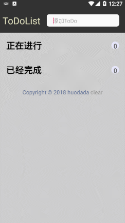

##### 代码实现

以下是xml布局代码

```java
<RelativeLayout
    android:layout_width="match_parent"
    android:layout_height="wrap_content"
    android:layout_margin="18dp">

    <TextView
        android:layout_width="wrap_content"
        android:layout_height="wrap_content"
        android:text="正在进行"
        android:textColor="#000"
        android:textSize="22sp"
        android:textStyle="bold" />

    <TextView
        android:id="@+id/tv_doing_number"
        android:layout_width="22dp"
        android:layout_height="22dp"
        android:layout_alignParentRight="true"
        android:layout_centerVertical="true"
        android:background="@drawable/tip"
        android:gravity="center"
        android:text="0"
        android:textColor="@color/tipText"
        android:textSize="16sp"
        android:textStyle="bold" />
</RelativeLayout>

<ListView
    android:id="@+id/lv_doing"
    android:layout_width="match_parent"
    android:layout_height="wrap_content"
    android:layout_marginLeft="18dp"
    android:layout_marginRight="18dp"
    android:divider="@null"
    android:dividerHeight="8dp" />
```

在ListView中使用divider属性可以自定义下划线，下面就是自定义ListView列表的布局，新建item_doing，内容如下：

```Java
<?xml version="1.0" encoding="utf-8"?>
<LinearLayout xmlns:android="http://schemas.android.com/apk/res/android"
    android:layout_width="match_parent"
    android:layout_height="wrap_content"
    android:orientation="horizontal"
    android:gravity="center_vertical"
    android:background="@drawable/shape_white_item">

    <TextView
        android:background="@drawable/shape_green_frame"
        android:layout_width="8dp"
        android:layout_height="match_parent" />

    <CheckBox
        android:id="@+id/cb_do"
        android:layout_marginLeft="5dp"
        android:layout_width="wrap_content"
        android:layout_height="wrap_content" />


    <EditText
        android:id="@+id/et_content"
        android:paddingTop="8dp"
        android:paddingBottom="6dp"
        android:textSize="14sp"
        android:hint="添加ToDo"
        android:imeOptions="actionDone"
        android:padding="1dp"
        android:background="@null"
        android:layout_weight="1"
        android:layout_width="0dp"
        android:layout_height="match_parent"/>

    <Button
        android:id="@+id/btn_del"
        android:layout_width="20dp"
        android:layout_height="20dp"
        android:layout_marginRight="5dp"
        android:background="@drawable/delete_selector"
        android:visibility="visible" />


    <Button
        android:id="@+id/btn_remove"
        android:background="@drawable/remove_selector"
        android:layout_marginRight="8dp"
        android:layout_width="20dp"
        android:layout_height="20dp" />
</LinearLayout>
```

添加功能的实现方法，我选择通过按确定的方式添加到正在进行的ListView中，同样，将确定的监听封装到EditTextTools中

```Java
public class EditTextTools {

	...

    public static void addChangeDataListener(final Context context, final UpdateListener listener, final EditText e1) {

        e1.setOnEditorActionListener(new TextView.OnEditorActionListener() {
            @Override
            public boolean onEditorAction(TextView v, int actionId, KeyEvent event) {
                boolean handle = false;
                if (actionId == KeyEvent.ACTION_DOWN) {
                    if (!e1.getText().toString().equals("")) {
                        if (listener == null) {
                            Toast.makeText(context, "修改成功", Toast.LENGTH_SHORT).show();
                        } else {
                            Toast.makeText(context, "添加成功", Toast.LENGTH_SHORT).show();
                            listener.etUpdate(e1.getText().toString());
                            e1.setText("");
                        }
                        // 关闭键盘
                        KeyboardTools.closeKeyboard(e1,context);
                        handle = true;
                    } else {
                        Toast.makeText(context, "请输入内容", Toast.LENGTH_SHORT).show();
                    }
                }
                return handle;
            }
        });
    }
}
```

这里设置了一个接口，用来监听输入内容返回的数据，UpdateListener代码如下

```Java
public interface UpdateListener {

    public void etUpdate(String s);
}
```

然后，我们在MainActivity的监听写法如下：

```Java
        EditTextTools.addChangeDataListener(this, new MyUpdateListener(), etContent);

    private class MyUpdateListener implements UpdateListener {

        @Override
        public void etUpdate(String s) {
            Content c = new Content(false, s);
            insert(c);
            doingContents.add(c);
            changeListNumber();
        }
    }
```

此外，在MainActivity实例化ListView。

```Java
    doingAdapter = new DoingAdapter(this, doingContents, new NotifyDoingListListener());
    lvDoing.setAdapter(doingAdapter);
    
    ...
    changeListNumber();
```
然后就是正在进行下的Adapter适配器的配置

```java
public class DoingAdapter extends BaseAdapter {

    private final NotifyListChangeListener changeListener;
    private List<Content> listItems;
    private Context context = null;

    public DoingAdapter(Context context, List<Content> listItems, NotifyListChangeListener changeListener) {
        this.context = context;
        this.listItems = listItems;
        this.changeListener = changeListener;
    }

    @Override
    public int getCount() {
        return listItems.size();
    }

    @Override
    public Object getItem(int position) {
        return listItems.get(position);
    }

    @Override
    public long getItemId(int position) {
        return position;
    }

    @Override
    public View getView(final int position, View convertView, ViewGroup parent) {
        View view;
        ViewHolder viewHolder;
        Content item = (Content) getItem(position);
        if (convertView == null) {
            view = LayoutInflater.from(context).inflate(R.layout.item_doing, parent, false);//LayoutInflater是用来找layout下xml布局文件，并且实例化
            viewHolder = new ViewHolder();
            //实例化
            viewHolder.cb_do = view.findViewById(R.id.cb_do);
            viewHolder.et_content = view.findViewById(R.id.et_content);
            viewHolder.btn_del = view.findViewById(R.id.btn_del);
            viewHolder.btn_remove = view.findViewById(R.id.btn_remove);
            view.setTag(viewHolder);
        } else {
            //这里复用了 ViewHolder
            view = convertView;
            viewHolder = (ViewHolder) view.getTag();
        }
        viewHolder.cb_do.setChecked(item.isCheck());
        viewHolder.cb_do.setOnCheckedChangeListener(new CompoundButton.OnCheckedChangeListener() {
            @Override
            public void onCheckedChanged(CompoundButton buttonView, boolean isChecked) {
                // 任务完成（改变位置）
                if (isChecked)
                    changeListener.notifyInsert(position);
            }
        });
        viewHolder.et_content.setText(item.getContent());
        EditTextTools.addClearListener(viewHolder.et_content, viewHolder.btn_del);
        EditTextTools.addChangeDataListener(context, null, viewHolder.et_content);
        viewHolder.et_content.setOnFocusChangeListener(new View.OnFocusChangeListener() {
            @Override
            public void onFocusChange(View v, boolean hasFocus) {
                if (!hasFocus) {
                    String s = ((EditText) v).getText().toString();
                    changeListener.notifyUpdate(position, s);
                }
            }
        });
        viewHolder.btn_remove.setOnClickListener(new View.OnClickListener() {
            @Override
            public void onClick(View v) {
                // 删除任务
                changeListener.notifyRemove(position);
            }
        });
        return view;
    }

    class ViewHolder {
        private CheckBox cb_do;
        private EditText et_content;
        private Button btn_del;
        private Button btn_remove;
    }
}
```

### 2——添加任务时可一键删除

##### 结果演示

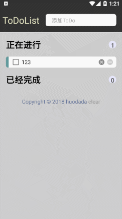

##### 代码实现

在DoingAdpater下添加封装好的监听即可。

```java
EditTextTools.addClearListener(viewHolder.et_content, viewHolder.btn_del);
```

### 3——正在进行的任务可修改

##### 结果演示

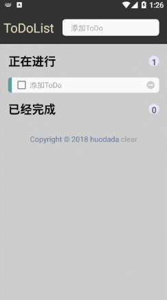

##### 代码实现

在DoingAdpater下添加封装好的监听即可。

```Java
EditTextTools.addChangeDataListener(context, null, viewHolder.et_content);
```

### 4——正在进行的任务可删除

结果演示

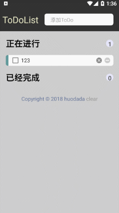

##### 代码实现

首先，监听DoingAdpater下remove按键的事件

```Java 
viewHolder.btn_remove.setOnClickListener(new View.OnClickListener() {
    @Override
    public void onClick(View v) {
        // 删除任务
        changeListener.notifyRemove(position);
    }
});
```

这里设置了一个接口，用于通知MainActivity更新ListView，接口如下，里面包含增删改三个信息反馈。

```Java
public interface NotifyListChangeListener {

    void notifyRemove(int position);

    void notifyInsert(int position);

    void notifyUpdate(int position, String data);
}
```

在MainActivity更新ListView信息

```Java
// 正在进行列表UI更新
public class NotifyDoingListListener implements NotifyListChangeListener {
    @Override
    public void notifyRemove(int position) {
        delete(doingContents.get(position));
        doingContents.remove(position);
        changeListNumber();
    }

    @Override
    public void notifyInsert(int position) {
        Content c = doingContents.get(position);
        c.setCheck(true);
        didContents.add(c);
        doingContents.remove(position);
        changeListNumber();
        update(c);
    }

    @Override
    public void notifyUpdate(int position,String s) {
        Content c = doingContents.get(position);
        c.setContent(s);
        doingContents.set(position,c);
    }
}
```

### 5——可让任务在正在进行和已经完成两个列表中随意切换

##### 结果演示

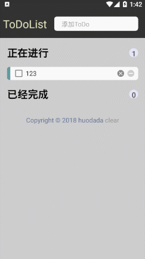

##### 代码实现

在两个Adapter中添加CheckBox状态改变监听

```Java
viewHolder.cb_do.setOnCheckedChangeListener(new CompoundButton.OnCheckedChangeListener() {
    @Override
    public void onCheckedChanged(CompoundButton buttonView, boolean isChecked) {
        // 任务完成（改变位置）
        if (isChecked)
            changeListener.notifyInsert(position);
    }
});
```

### 6——已经完成的任务可删除

##### 结果演示

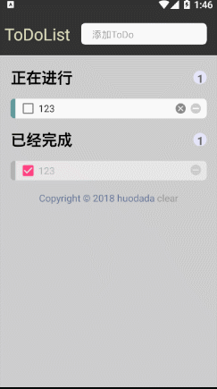

##### 代码实现

代码和DoingAdapter重复。

### 7——已经完成的任务不可修改

##### 结果演示


##### 代码实现

在DigAdapter添加禁止聚焦，因为EditText不是靠Click触发的，所以onClick(false)是没有任何效果的。

```java 
// 已经完成的任务禁止修改
viewHolder.et_content.setFocusable(false);
```

### 8——显示当前的任务数量

##### 结果演示


##### 代码实现

```Java
// 通知UI更新数据
private void changeListNumber() {
    tvDoingNumber.setText(Integer.toString(doingContents.size()));
    doingAdapter.notifyDataSetChanged();
    tvDidNumber.setText(Integer.toString(didContents.size()));
    didAdapter.notifyDataSetChanged();
}
```

### 9——一键删除所有列表

##### 结果演示

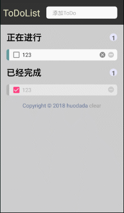

##### 代码实现

```
tvClear.setOnClickListener(new ClearListener());

    // 一键清除
    private class ClearListener implements View.OnClickListener {
        @Override
        public void onClick(View v) {
            doingContents.clear();
            didContents.clear();
            changeListNumber();
            // 一键清除数据库表
            ContentDatabase.getInstance(MainActivity.this).getContentDao().deleteAll();
        }
    }
```

### 10——数据保存至数据库中

##### 代码实现

将Room例程移植进来即可，然后封装增删改查，在需要实现的地方调用即可。

```Java
// 增
private void insert(Content content) {
    ContentDatabase.getInstance(MainActivity.this).getContentDao().insert(content);
}
// 删
private void delete(Content content) {
    ContentDatabase.getInstance(MainActivity.this).getContentDao().delete(content);
}
// 改
private void update(Content content) {
    ContentDatabase.getInstance(MainActivity.this).getContentDao().update(content);
}
// 查
private List query() {
    return ContentDatabase
            .getInstance(MainActivity.this)
            .getContentDao()
            .getAllContents();
}
```

#### 1）打开App读取所有数据（查实现）

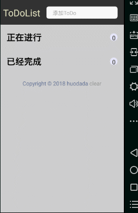

#### 2）能增加数据（增实现）

#### 3）能删除数据（删实现）

#### 4）界面销毁后保存界面上的所有数据（由查和改共同实现）

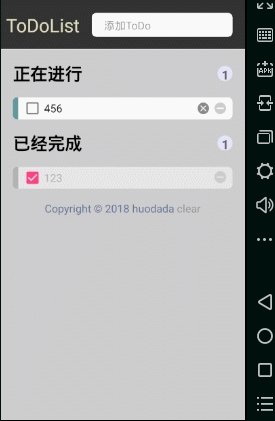

#### 5）一键删除所有数据（添加删除表的SQL语句）

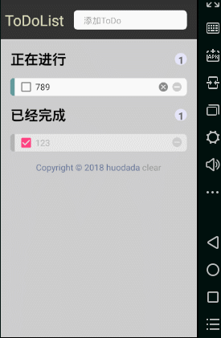