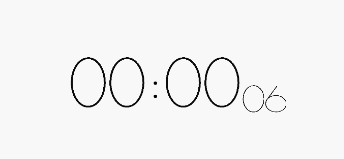
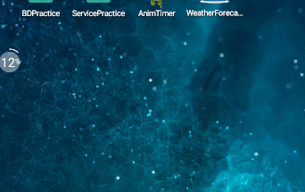

# 案例效果演示
本章案例比较简单，大家可以拿来当做实现ViewAnimation特效的练习，我已经在源码中添加了很多注释。



## Usage
### Add View Layout
```xml
<RelativeLayout xmlns:android="http://schemas.android.com/apk/res/android"
                xmlns:ta="http://schemas.android.com/apk/res-auto"
                android:layout_width="match_parent"
                android:layout_height="match_parent"
                android:background="#FFFFFF">

    <!-- Custom Properties -->
    <com.jiahuan.timelyanimation.NumberSwitchView
        android:id="@+id/numberswitchview"
        android:layout_width="130dp"
        android:layout_height="200dp"
        ta:ta_number_animation_duration="600"
        ta:ta_number_bg_color="#000000"
        ta:ta_number_stroke_width="3dp"
        ta:ta_number_color="#FFFFFF">
    </com.jiahuan.timelyanimation.NumberSwitchView>
</RelativeLayout>
```

### Java
```java
mNumberSwitchView = (NumberSwitchView) findViewById(R.id.numberswitchview);
// animation function number = [0,9]
mNumberSwitchView.animateTo(number);
```

## Example
```java
public class MainActivity extends Activity
{
    private NumberSwitchView mNumberSwitchView;
    int number = 0;

    private Handler handler = new Handler()
    {
        @Override
        public void handleMessage(Message msg)
        {
            if (number % 3 == 0)
            {
                mNumberSwitchView.setNumberColor(Color.RED);
                mNumberSwitchView.setNumberBGColor(Color.BLACK);
            }
            else
            {
                mNumberSwitchView.setNumberColor(Color.rgb(10, 10, 10));
                mNumberSwitchView.setNumberBGColor(Color.BLUE);
            }
            mNumberSwitchView.animateTo(number);
        }
    };


    @Override
    protected void onCreate(Bundle savedInstanceState)
    {
        super.onCreate(savedInstanceState);
        setContentView(R.layout.activity_main);
        mNumberSwitchView = (NumberSwitchView) findViewById(R.id.numberswitchview);
        TimerTask timerTask = new TimerTask()
        {
            @Override
            public void run()
            {
                number++;
                if (number > 9)
                {
                    number = 0;
                }

                handler.obtainMessage().sendToTarget();
            }
        };
        Timer timer = new Timer();
        timer.schedule(timerTask, 1000, 1000);
    }
}
```

## 有话要说

说说library下的具体实现类思路：NumberSwitchView

关键代码如下，更多注释可在NumberSwitchView查找：

```
@Override
        protected void applyTransformation(float interpolatedTime, Transformation t) {
            if (interpolatedTime != 1) {
                // 这样写 for 减少计算量
                for (int i = 0, N = from.length; i < N; i++) {
                    // 通过该算法能计算出平移过程中的数字点的分布位置，也就是实现平移的过程。
                    // 该算法可以抄 TranslateAnimation 源码下的 applyTransformation 算法实现。
                    currentNumberPoints[i] = from[i] + (to[i] - from[i]) * interpolatedTime;
                }
                invalidate();
            }
        }
```

### 特效本质：

​	点平移动画。

### 实现思路：

​	在此之前我们已经定义了每个数字的108点，将108个点用线连起来就是我们的数字。因为每个不同数字间的点分布是不同的，所以我们可以通过startAnimation()启动点 的平移动画，平移过程点的分布在重写的 applyTransformation 中实现。然后，每 改变一次分布就通过 invalidate() 方法刷新界面，通过 onDraw() 重新绘制。

### 思考：
​	留一个思考题，我们可以看到 TranslateAnimation 是通过 t.getMatrix().setTranslate(dx, dy) 方法实现平移特效的，显然这种方法更加高效。 那么我们能否也效仿此举，改写如今使用 invalidate() 以达刷新的方法？


## 扩展

我们也可以做一个酷炫的电子表。



代码如下：

```
// 变成时钟
Time t=new Time(); // or Time t=new Time("GMT+8"); 加上Time Zone资料。
t.setToNow(); // 取得系统时间。
hourNumber = t.hour; // 0-23
minuteNumber = t.minute;
number = t.second;
```