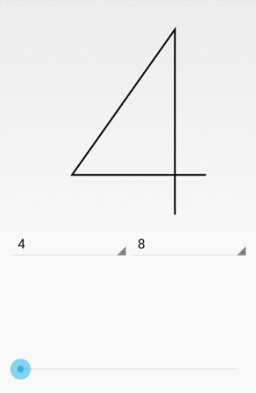

TimelyTextView
==============

如果想做练习，可以选择炫酷的计时器（https://github.com/roushanburou/AndroidBook/tree/master/Chapter9/TimelyAnimationPractice）

但是练习上的效果绘制太快，我特意在网上找了一个开源的特效项目，专门用于演示。本例程是利用属性动画，所以我们不做讲解了。

