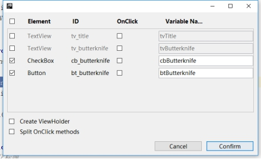
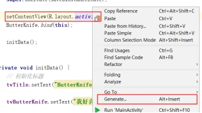
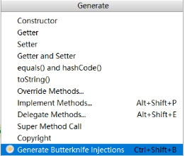
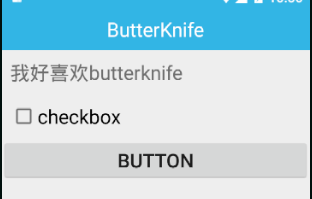

## 简介

ButterKnife是注解中相对简单易懂的很不错的开源框架：

1.强大的View绑定和Click事件处理功能，简化代码，提升开发效率
2.方便的处理Adapter里的ViewHolder绑定问题
3.运行时不会影响APP效率，使用配置方便
4.代码清晰，可读性强

## 下载地址

https://github.com/JakeWharton/butterknife

## 使用步骤

1）在Setting->Plugins中输入butterknife添加插件

Android ButterKnife Aelezny ->点击安装



2）重启一遍Android studio，然后在build.gradle下添加依赖

```java
dependencies {
    ..
    implementation 'com.jakewharton:butterknife:8.8.1'
    annotationProcessor 'com.jakewharton:butterknife-compiler:8.8.1'
}
```

3）然后鼠标对着R.layout.xxx 那行右键 如下图



点进Generate后 选择ButterKnife那项




将我们想要安排的控件勾上，点击confirm就后，就可以发现我们要的控件都帮我们生成辣 。

```java
public class MainActivity extends AppCompatActivity {

    @BindView(R.id.tv_title)
    public TextView tvTitle;
    @BindView(R.id.tv_butterknife)
    public TextView tvButterKnife;

    @Override
    protected void onCreate(Bundle savedInstanceState) {
        super.onCreate(savedInstanceState);

        setContentView(R.layout.activity_main);
        ButterKnife.bind(this);

        initData();
    }

    private void initData() {
        // 初始化标题
        tvTitle.setText("ButterKnife");

        tvButterKnife.setText("我好喜欢butterknife");
    }

    @OnCheckedChanged(R.id.cb_butterknife)
    public void onCheckedChanged(CompoundButton buttonView, boolean isChecked){
        if (isChecked)
            Toast.makeText(MainActivity.this, "选中了checkbox", Toast.LENGTH_SHORT).show();
        else Toast.makeText(MainActivity.this, "取消了checkbox", Toast.LENGTH_SHORT).show();
    }

    @OnClick(R.id.bt_butterknife)
    public void btButterKnife(View view) {
        Toast.makeText(MainActivity.this, "点击了button", Toast.LENGTH_SHORT).show();
    }
}
```

## 常用功能

> 主要针对7.0.1版本

#### 1）省略findViewById()

##### （1）Activity中使用

##### （2）Fragment中使用

##### （3）Adapter ViewHolder中使用

#### 2）省略setOnClickListener()

#### 3）ListView的点击@OnItemClick, CheckBox的@OnCheckedChanged也可以实现省略操作

#### 4）可以一次指定多个id,为多个View绑定一个事件处理方法

## 更多使用参考

https://www.jianshu.com/p/3678aafdabc7

## 功能演示

