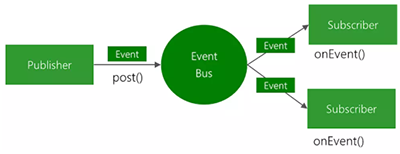
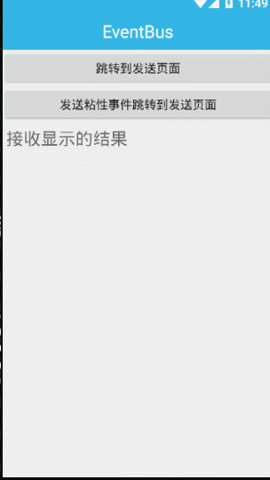
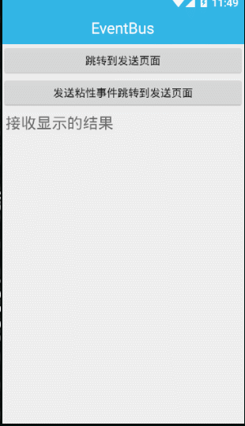

## 简介

当一个Android应用功能越来越多的时候，保证应用的各个部分之间高效的通信将变得越来越困难。所以为了解决这个问题，EventBus应运而生！
 EventBus是一款针对Android优化的发布/订阅事件总线。主要功能是替代Intent,Handler,BroadCast在Fragment，Activity，Service，线程之间传递消息.优点是开销小，代码更优雅，它简化了组件之间的通信，使我们的应用程序更加简单、通信更加快捷。我们来看EventBus的消息传递图：



> 举个通俗点的例子，EventBus消息机制就是我们生活中的寄快递，你去快递站点寄快递，你就是事件发送者，你的包裹就是事件，快递站点就是EventBus，接收快递的人就是事件订阅者。快递公司经过装车分类最后把你的快递寄到收件人手里，就类似EventBus最后将事件成功传达。

## 下载地址

https://github.com/greenrobot/EventBus

## 使用步骤

1）在build.gradle下添加依赖

```java
dependencies {
    ...
    implementation 'org.greenrobot:eventbus:3.1.1'
}
```

2）注册

```Java
EventBus.getDefault().register(MainActivity.this);
```

3）解注册

```Java
EventBus.getDefault().unregister(MainActivity.this);
```

4）构造发送消息类

```Java
public class MessageEvent {

    public String name;

    public MessageEvent(String name) {
        this.name = name;
    }
}
```

5）发布消息

```Java
EventBus.getDefault().post(new MessageEvent("主线程发送过来的数据"));
```

6）接收消息

```
@Subscribe(threadMode = ThreadMode.MAIN)
public void MesssageEventBus(MessageEvent event){

    // 显示接收的消息
    tv_eventbus_result.setText(event.name);
}
```

​	ThreadMode.MAIN：表示这个方法在主线程中执行
​	ThreadMode.BACKGROUND：表示该方法在后台执行，不能并发处理
​	ThreadMode.ASYNC：也表示在后台执行，可以异步并发处理。
​	ThreadMode.POSTING：表示该方法和消息发送方在同一个线程中执行

## 更多参考

https://www.jianshu.com/p/f9ae5691e1bb

源码解析可以参考 https://www.jianshu.com/p/89ee7dcbaca9

## 功能演示

##### 发送普通事件



##### 发送粘性事件

