## JSON简介

JSON的全称是JavaScript Object Notation，是一种轻量级的数据交换格式。

其特点如下：

1. 本质就是具有特定格式的字符串
2. JSON完全独立于编程语言
3. JSON比XML数据传输的有效性要高出很多。

json一共有两种数据结构，一种是以 (key/value)对形式存在的无序的jsonObject对象，一个对象以“{”（左花括号）开始，“}”（右花括号）结束。每个“名称”后跟一个“:”（冒号）；“‘名称/值’ 对”之间使用“,”（逗号）分隔。

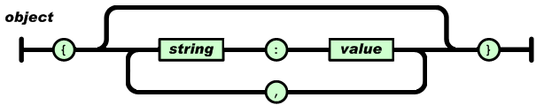

例如：{"name": "xiaohuo"}， 这就是一个最简单的json对象，对于这种数据格式，key值必须要是string类型，而对于value，则可以是string、number、object、array等数据类型：

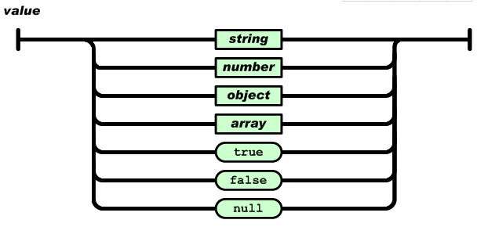

另一种数据格式就是有序的value的集合，这种形式被称为是jsonArray，数组是值（value）的有序集合。一个数组以“[”（左中括号）开始，“]”（右中括号）结束。值之间使用“,”（逗号）分隔。

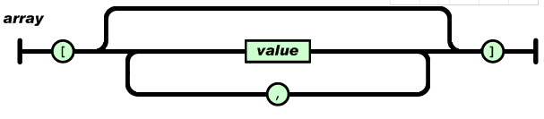

更多的有关json数据格式可以参加json的官网，http://www.json.org/json-zh.html

## JSONObject

Android原生技术，不用加载任何框架，但问题是编程相对麻烦了点。

## GSON

GSON是Google提供的用来在Java对象和JSON数据之间进行映射的Java类库。可以将一个Json字符转成一个Java对象，或者将一个Java转化为Json字符串。

特点：a、快速、高效

​    　　b、代码量少、简洁

​    　　c、面向对象

​       　d、数据传递和解析方便

### 使用步骤

见例程

### 下载地址

https://mvnrepository.com/artifact/com.google.code.gson/gson

## FastJson

Fastjson是阿里开发的一个Java语言编写的高性能功能完善的JSON库。它采用一种“假定有序快速匹配”的算法，把JSON Parse的性能提升到极致，是目前Java语言中最快的JSON库。

### 使用步骤

见例程

### 下载地址

https://github.com/alibaba/fastjson/wiki

## GsonFormat插件使用

1）打开Android studio页面，点击设置按钮。

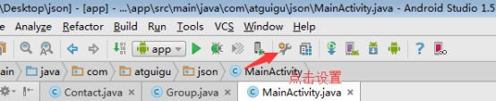

2）点击Plugins按钮

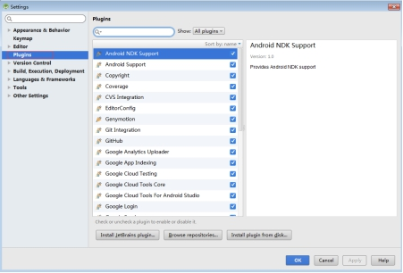

3）在右侧输入框中输入gsonformat,然后点击中间部位的Browse(必须在联网情况下点击)

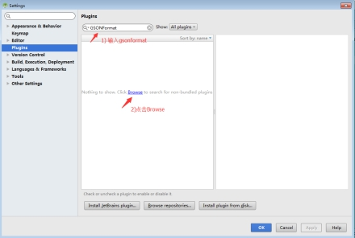

4）选择GsonFormat，点击右侧的安装插件

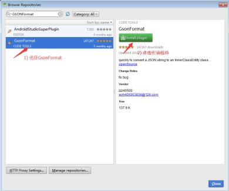

5）重启一下Android studio

6）在Android studio中创建一个类

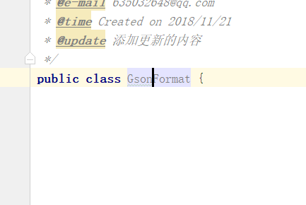

7）在该类中同时按下alt+insert，并点击GsonFormat

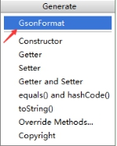

8）将要解析的JSON字符串粘贴到GsonFormat中

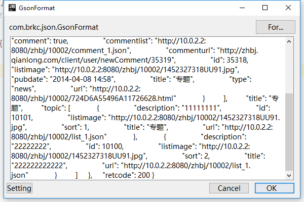

9）点击OK

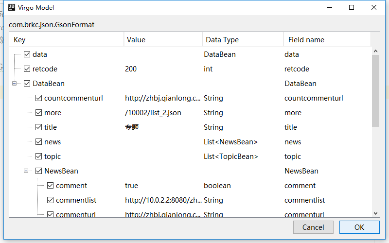

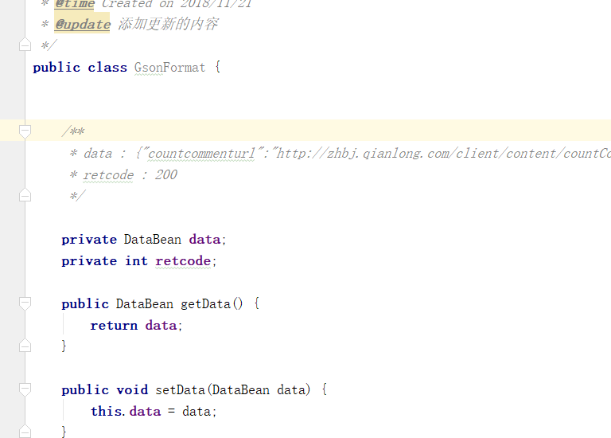

## 功能演示

### NativeJsonPrase

##### 将JSON对象转换为Java对象

##### 将JSON数组转换为Java集合

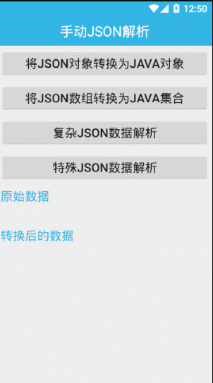

##### 复杂JSON数据解析

##### 特殊JSON数据解析

### FastJson

##### 将JSON对象转换为Java对象

##### 将JSON数组转换为Java集合

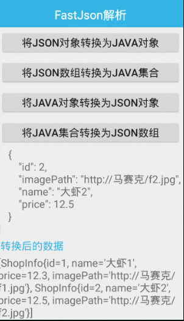

##### 将java对象转换为JSON对象

##### 将java集合转换为JSON数组

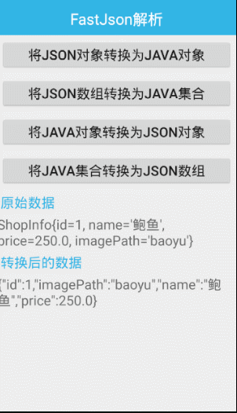

### Gson

##### 将JSON对象转换为Java对象

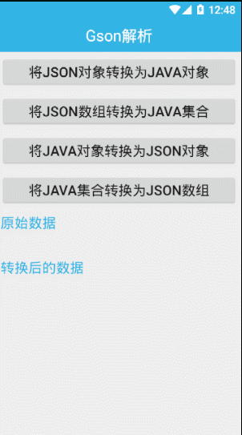

##### 将JSON数组转换为Java集合

##### 将java对象转换为JSON对象

##### 将java集合转换为JSON数组

