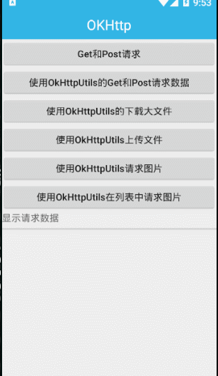
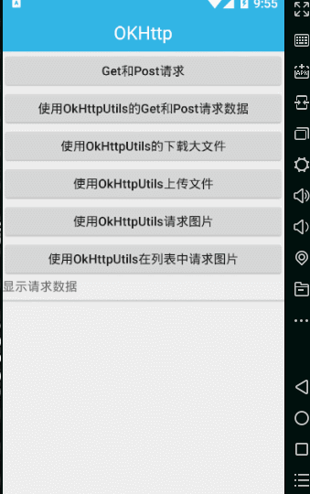

本例程详细讲解了原生 OKHttp 和封装后 OKHttp 的使用方法，包括文件的上传、下载、大图片的加载等企业中最常用的方法。

## OKHttp简介

OKHttp是一款高效的HTTP客户端，支持连接同一地址的链接共享同一个socket，通过连接池来减小响应延迟，还有透明的GZIP压缩，请求缓存等优势，其核心主要有路由、连接协议、拦截器、代理、安全性认证、连接池以及网络适配，拦截器主要是指添加，移除或者转换请求或者回应的头部信息

这个库也是square开源的一个网络请求库(okhttp内部依赖okio)。现在已被Google使用在Android源码上了，可见其强大。

关于网络请求库，现在应该还有很多人在使用android-async-http。他内部使用的是HttpClient，但是Google在6.0版本里面删除了HttpClient相关API，可见这个库现在有点过时了。

### 下载地址

 <http://square.github.io/okhttp/>

### 主要功能

1、联网请求文本数据
2、大文件下载
3、大文件上传
4、请求图片

### OkHttp源码分析及使用

想了解OkHttp3的使用流程，可访问 https://www.cnblogs.com/jianyungsun/p/6640151.html

想了解OkHttp3的框架原理，可访问 https://www.jianshu.com/p/9deec36f2759，内有详细的图文说明。

## okhttp-utils

> 访问网址：https://github.com/hongyangAndroid/okhttputils
>
> 由于个人原因，现已停止维护。

对okhttp的封装类，okhttp见：[https](https://github.com/square/okhttp)：[//github.com/square/okhttp](https://github.com/square/okhttp)。

目前对应okhttp版本`3.3.1`。

#### 用法

```Java
dependencies {
    ...
    implementation 'com.zhy:okhttputils:2.6.2'
}
```

## 功能演示

##### 使用OkHttp的Get和Post请求



##### 使用OkHttpUtils的Get和Post请求


##### 使用OkHttpUtils的下载大文件


##### 使用OkHttpUtils请求图片



##### 使用OkHttpUtils在列表中请求图片

