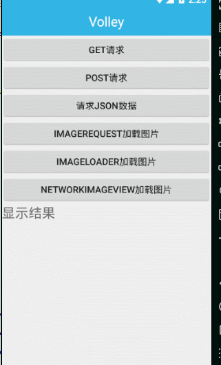

## Volley简介

Android开发团队也是意识到了有必要将HTTP的通信操作再进行简单化，于是在2013年Google I/O大会上推出了一个新的网络通信框架——Volley。Volley可是说是把AsyncHttpClient和Universal-Image-Loader的优点集于了一身，既可以像AsyncHttpClient一样非常简单地进行HTTP通信，也可以像Universal-Image-Loader一样轻松加载网络上的图片。除了简单易用之外，Volley在性能方面也进行了大幅度的调整，它的设计目标就是非常适合去进行数据量不大，但通信频繁的网络操作，而对于大数据量的网络操作，比如说下载文件等，Volley的表现就会非常糟糕。

Volley提供以下的好处：

- 自动调度网络请求。
- 多个并发网络连接。
- 具有标准HTTP [缓存一致性的](http://en.wikipedia.org/wiki/Cache_coherence)透明磁盘和内存响应缓存 。
- 支持请求优先级。
- 取消请求API。您可以取消单个请求，也可以设置要取消的请求块或范围。
- 易于定制，例如，重试和退避。
- 强大的排序，可以使用从网络异步获取的数据轻松正确填充UI。
- 调试和跟踪工具。

缺点：就是对于大数据量的网络操作，比如说下载文件等，Volley的表现不好。

## 使用步骤

1）dependencies

一共有两种方法可以使用 Volley

第一种直接远程依赖即可

```Java
dependencies {
    ...
    compile 'com.android.volley:volley:1.1.1'
}
```

第二种可访问官网直接下载，https://github.com/google/volley。注意，官方提供的不是jar包而是library。这里我拿别人封装好的jar包进行依赖。

```Java
dependencies {
	..
    implementation files('libs/volley.jar')
}
```

2）权限

```Java
<uses-permission android:name="android.permission.INTERNET" />
```

## 更多参考

可访问Android官网搜索Volley更多用法，https://developer.android.google.cn/training/volley/

## 功能演示

##### 使用Volley的Get和Post请求


##### 使用Volley请求JSON数据


##### ImageRequest和ImageLoader加载图片


##### 使用NetworkImageView请求图片


